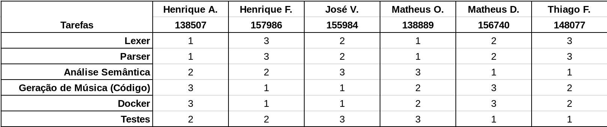

# Etapas
O projeto será realizado em três etapas (*milestones*):

## Etapa 1
Para entrega da primeira etapa faremos um compilador que converterá um código em uma música. A idéia é que ao final da entrega tenhamos o esqueleto da linguagem *Apollo*, com a função de criar uma música simples através das configurações necessárias do .mid e do uso de variáveis. 

Os componentes basicos das nossas "partituras" serão:

  - notas musicais:
    - `play: [pitch1, pitch2, ...]` - essa função irá tocar quantas notas forem fornecidas, de acordo com seus pitchs.
      - `pitch`: define a nota à ser tocada de acordo com seu pitch, que varia de 0 a 127, de acordo com os chamados "MIDI numbers".
    - `amp = amp` - define a amplitude das próximas notas que serão tocadas, definindo a dinâmica da música.
    - `dur = dur` - define a duração das próximas notas que serão tocadas dentro da música.
    - `VAR: var_id` - define uma variável que pode ser usada dentro da função `play` para substituir parte da sequência de notas.

Com esses componentes, será possível já tocar algumas melodias simples. Além disso, podemos tocar acordes (conjunto de notas tocadas ao mesmo tempo), determinando quais notas devem ser tocadas simultaneamente com o uso de `()`, como por exemplo:
```
play: [72, (60, 61, 62), 73]
```
Neste caso, teremos as notas correspondentes aos pitches `60`, `61` e `62` tocando ao mesmo tempo, formando um acorde.

## Etapa 2
Na segunda etapa do projeto iremos implementar loops, synthesizers e operações em variáveis.

__Loops:__
Loops também são estruturas da linguagem que faz muito sentido dado o seu propósito (produzir música). Podemos, por exemplo, designar por um label um refrão, e repetir
dentro do loop o refrão.

__Synthesizer:__
Synthesizers podem ser interpretados como os "instrumentos" que irão tocar as notas especificadas pelo programador. Assim é possível, por exemplo, que toquemos
uma música com uma guitarra ou com um berimbau.

__Operações:__
As operações em cima das variáveis serão simples operações de adição e subtração. As operações poderão ser feitas em cima de uma escala pré definida ou cromaticamente,
i.e. uma operação var += 1 poderá ir para a próxima nota dentro da escala pré definida ou simplesmente a próxima nota.

__Representação das Notas:__
As notas poderão ser reprentadas com letras e não apenas números. Em vez de escrever 36, poderemos escrever C_3 que terá o mesmo efeito.

__Suporte a Tonalidades:__
Além da última feature apresentada, poderemos fazer com que as notas sejam tocadas de acordo com o tom que está sendo usado. Ao escrever C_3 em Ré Maior sera tocado C_3 #, pois Ré maior ja tem Dó com um sustenido em sua armadura.

## Etapa 3
Essa etapa será a mais desafiadora: aqui objetivamos implementar paralelismo de instrumentos para que vários sons de diversos instrumentos toquem simultaneamente.

Será implementado arpeggios em forma de uma função. O usuário poderá chamar uma função na forma arpeggio( nota_inicial, tamanho, tom ) que retornará a próxima nota dentro do arpeggio.
Poderá também reiniciar o arpeggio chamando apenas arpeggio() para retornar ao estado inicial.

Será implementado funções para o usuário.


# Distribuição do trabalho
Nesta seção, detalhamos a distribuição do trabalho para cada um dos 6 membros da equipe. Os números em cada célula indicam em qual etapa aquele membro trabalhará naquela parte do projeto.


